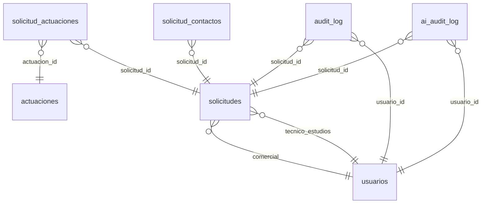

<!-- AUTO-GENERATED. Run: python scripts/gen_domain_docs.py -->

# Vedisa CRM - Dominio

Documento generado automaticamente desde las anotaciones de los modelos SQLModel (`__meta__` + `description` por Field + `__field_meta__`) y el catalogo de reglas de negocio (`app/services/business_rules.py`). No editar a mano: regenerar con `python scripts/gen_domain_docs.py`.

## Indice

- [Entidades](#entidades)
  - [actuaciones](#actuaciones)
  - [ai_audit_log](#ai_audit_log)
  - [audit_log](#audit_log)
  - [solicitud_actuaciones](#solicitud_actuaciones)
  - [solicitud_contactos](#solicitud_contactos)
  - [solicitudes](#solicitudes)
  - [usuarios](#usuarios)
- [Relaciones](#relaciones)
- [Enums](#enums)
- [Reglas de negocio](#reglas-de-negocio)
- [Endpoints](#endpoints)

## Entidades

### actuaciones

**Clase Python**: `Actuacion`

Catalogo cerrado de tipos de actuacion que ofrece Vedisa.

**Significado de negocio**: Inventario fijo (fachada, cubierta, estructura...) que el comercial asigna a una solicitud. Alimenta el donut 'Mix de actuaciones' del dashboard y las lineas del PDF de oferta.

**Ciclo de vida**: Catalogo semilla seteado por migracion Alembic; rara vez crece.

| Campo | Tipo | Req | Calc | Descripcion | Negocio |
|---|---|---|---|---|---|
| `id` | `str` | PK |  | Slug estable, ej. 'fachada'. ej. fachada, cubierta, estructura, sate, zbcc | Identificador legible que aparece en URLs y filtros. |
| `nombre` | `str` | si |  | Etiqueta humana del tipo de actuacion. | Lo que se muestra en checkboxes del panel y en el PDF. |
| `orden` | `int` | no |  | Orden de presentacion en el UI. | Controla la posicion del checkbox en la lista del panel. |
| `activo` | `bool` | no |  | Si False, el catalogo deja de ofrecerlo. | Permite retirar una actuacion sin borrarla y perder historial. |

### ai_audit_log

**Clase Python**: `AIAuditLog`

Bitacora de llamadas a proveedores LLM (analyze / chat / test).

**Significado de negocio**: Permite analizar coste y latencia por proveedor / modelo, y detectar errores recurrentes en la integracion con OpenAI / Anthropic / etc.

**Ciclo de vida**: Insercion automatica al llamar al router LLM; nunca se borra desde el codigo.

| Campo | Tipo | Req | Calc | Descripcion | Negocio |
|---|---|---|---|---|---|
| `id` | `str` | PK |  | UUID v4 de la llamada. | Identificador estable de la operacion en metricas y debugging. |
| `endpoint` | `str` | si |  | Endpoint logico que origino la llamada. ej. analyze, chat, test | Distingue si la llamada vino del drawer (analyze), chat o test de salud. |
| `solicitud_id` | `str` | no |  | FK opcional a la solicitud en cuyo contexto se llamo al LLM. | Permite cruzar consumo IA con oportunidades comerciales. |
| `usuario_id` | `str` | no |  | FK opcional al usuario que disparo la llamada. | Atribuye el consumo a una persona para reporting. |
| `provider` | `str` | si |  | Proveedor LLM efectivo (openai, anthropic...). | Permite comparar coste y latencia entre proveedores. |
| `model` | `str` | si |  | Modelo concreto utilizado (gpt-4o, claude-3.5-sonnet, etc.). | Granularidad fina del proveedor para metricas y A/B de calidad. |
| `prompt_tokens` | `int` | no |  | Tokens consumidos en el prompt. _tokens_ | Mitad input del coste por llamada. |
| `completion_tokens` | `int` | no |  | Tokens generados en la respuesta. _tokens_ | Mitad output del coste; suele ser mas cara por token. |
| `total_tokens` | `int` | no | si | Suma prompt + completion (calculado). _tokens_ | Magnitud total de la llamada para reporting agregado. |
| `latency_ms` | `int` | no |  | Latencia total de la llamada en milisegundos. _ms_ | Mide el coste de tiempo real para el usuario que dispara la IA. |
| `success` | `bool` | no |  | True si la llamada se completo sin error. | Permite calcular tasa de fallos por proveedor / modelo. |
| `error_msg` | `str` | no |  | Mensaje de error si success=False. | Pista para diagnosticar fallos recurrentes del proveedor o del prompt. |
| `created_at` | `datetime` | no |  | Timestamp UTC de la llamada. | Permite ventanas temporales para reporting de consumo IA. |

### audit_log

**Clase Python**: `AuditLog`

Bitacora append-only de cambios sobre solicitudes.

**Significado de negocio**: Trazabilidad completa: cada update genera una fila por campo cambiado, los cambios de estado quedan con accion 'estado_change', y el reemplazo de actuaciones con 'actuaciones_update'. Se lee desde /historial en el panel del CRM.

**Ciclo de vida**: Insercion automatica al modificar una solicitud; nunca se borra ni se actualiza.

| Campo | Tipo | Req | Calc | Descripcion | Negocio |
|---|---|---|---|---|---|
| `id` | `str` | PK |  | UUID v4 de la entrada de auditoria. | Identificador estable para una operacion concreta del historial. |
| `solicitud_id` | `str` | si |  | FK a la solicitud auditada. | Permite reconstruir la historia completa de cambios de una solicitud. |
| `usuario_id` | `str` | no |  | FK al usuario que realizo el cambio (None si fue sistema). | Atribuye el cambio a la persona para auditoria y responsabilidad. |
| `accion` | `str` | si |  | Tipo de operacion auditada (create / update / delete / estado_change / actuaciones_update). ej. create, update, delete, estado_change, actuaciones_update | Distingue create / update / estado_change / actuaciones_update / delete para filtros del historial. |
| `campo` | `str` | no |  | Nombre del campo cambiado (None en create / delete). | Permite saber exactamente que dato se modifico en cada fila de la bitacora. |
| `valor_anterior` | `str` | no |  | Valor del campo antes del cambio, serializado a string. | Diff lateral del campo, util para deshacer o investigar. |
| `valor_nuevo` | `str` | no |  | Valor del campo despues del cambio, serializado a string. | Estado actual del campo justo despues de la operacion. |
| `created_at` | `datetime` | no |  | Timestamp UTC del cambio. | Ordena la bitacora; el historial del UI muestra entradas en DESC por este campo. |

### solicitud_actuaciones

**Clase Python**: `SolicitudActuacion`

Linea de actuacion asignada a una solicitud, con superficie e importe.

**Significado de negocio**: Detalle constructivo de la oferta: para cada actuacion del catalogo que aplica al proyecto, guarda m2 estimados e importe asociado. Se usa para construir la tabla de actuaciones del PDF de oferta.

**Ciclo de vida**: Creada al activar el checkbox en el panel; borrada al desactivarlo. PK compuesto (solicitud_id, actuacion_id) garantiza unicidad.

| Campo | Tipo | Req | Calc | Descripcion | Negocio |
|---|---|---|---|---|---|
| `solicitud_id` | `str` | PK |  | FK a la solicitud padre. | Vincula esta linea de actuacion al proyecto comercial. |
| `actuacion_id` | `str` | PK |  | FK a la actuacion del catalogo. | Indica que tipo de obra concreto se incluye en esta linea. |
| `m2` | `float` | no |  | Superficie estimada en metros cuadrados. _m2_ | Magnitud principal para dimensionar la oferta de esta actuacion. |
| `importe` | `float` | no |  | Importe asignado a esta linea, en EUR. _EUR_ | Suma de todas las lineas debe cuadrar con la oferta total de la solicitud. |
| `created_at` | `datetime` | no |  | Timestamp UTC de creacion de la linea. | Auditoria basica de cuando se anadio la actuacion al proyecto. |

### solicitud_contactos

**Clase Python**: `SolicitudContacto`

Contacto humano asociado a una solicitud (admin, tecnico de obra, propiedad...).

**Significado de negocio**: Lista de personas con las que hablar para esa oportunidad: telefono, email y rol. Sustituye al JSON legacy 'contactos' de Solicitud.

**Ciclo de vida**: Creado, editado y borrado libremente. Se borra al borrar la solicitud padre.

| Campo | Tipo | Req | Calc | Descripcion | Negocio |
|---|---|---|---|---|---|
| `id` | `str` | PK |  | UUID v4 generado server-side. | Identificador estable para edicion / borrado individual. |
| `solicitud_id` | `str` | si |  | FK a la solicitud padre. | Vincula el contacto al proyecto comercial donde se usa. |
| `tipo` | `str` | si |  | Rol del contacto dentro de la obra. ej. administracion, tecnico_obra, ensena_obra, presidente, propiedad | Permite al comercial saber a quien dirigirse para cada gestion. |
| `nombre` | `str` | no |  | Nombre del contacto. | Lo que el comercial dice al llamar. |
| `telefono` | `str` | no |  | Telefono libre (sin validacion de formato). | Canal principal de contacto en obra y administracion. |
| `email` | `str` | no |  | Email del contacto. | Usado para envio de oferta y comunicaciones formales. |
| `notas` | `str` | no |  | Notas libres sobre el contacto. | Detalles utiles que no caben en los campos estandar (horario, idioma, preferencias). |
| `created_at` | `datetime` | no |  | Timestamp UTC de creacion. | Permite ordenar contactos por orden de alta. |
| `updated_at` | `datetime` | no |  | Timestamp UTC de la ultima modificacion. | Detecta cambios recientes en datos de contacto. |

### solicitudes

**Clase Python**: `Solicitud`

Oportunidad comercial / proyecto en el pipeline.

**Significado de negocio**: Unidad central del CRM. Recorre el embudo desde En Estudio hasta Adjudicada o Rechazada; concentra la oferta economica, las actuaciones, el calendario y la asignacion comercial / tecnica.

**Ciclo de vida**: En Estudio -> Enviada (requiere fecha_enviado + oferta>0) -> Adjudicada o Rechazada (requieren fecha_cierre_cliente). Descartada para cerrar sin ganar ni perder.

| Campo | Tipo | Req | Calc | Descripcion | Negocio |
|---|---|---|---|---|---|
| `id` | `str` | PK |  | UUID v4 generado al crear la solicitud. | Identificador estable referenciado por FK en audit_log, contactos y actuaciones. |
| `codigo` | `str` | si |  | Codigo legible tipo SOL-2026-ABCD. ej. SOL-2026-0001 | Lo que ve el cliente y el comercial en el dia a dia; aparece en PDF y recordatorios. |
| `nombre_corto` | `str` | si |  | Nombre breve de la obra o proyecto. | Etiqueta humana usada en listados, kanban y asunto de mailto. |
| `poblacion` | `str` | no |  | Ciudad o localidad de la obra. | Permite agrupar geograficamente y filtrar el pipeline. |
| `estado` | `str` | no |  | Estado actual de la solicitud en el embudo. ej. En Estudio, Enviada, Adjudicada, Rechazada, Descartada | Indica en que fase del pipeline esta y que validaciones rigen. |
| `kanban_column` | `str` | no |  | Columna del tablero kanban donde se renderiza la tarjeta. | Normalmente igual a estado; permite agrupar columnas custom en el UI. |
| `color_estado` | `str` | no |  | Color hex asociado a la tarjeta en el kanban. | Pista visual rapida del estado en el tablero. |
| `prioridad` | `str` | no |  | Prioridad asignada a la solicitud (alta / media / baja). ej. alta, media, baja | Marca el orden de atencion del comercial; alta destaca con color en filtros. |
| `comercial` | `str` | no |  | FK al usuario comercial asignado. | Quien lleva la relacion con el cliente; ve esta solicitud en sus alertas. |
| `tecnico_estudios` | `str` | no |  | FK al usuario tecnico de estudios. | Quien valora coste y prepara la oferta tecnica. |
| `tipo_via` | `str` | no |  | Tipo de via (Calle, Avenida, Plaza...). | Compone la direccion mostrada en el PDF y en el detalle. |
| `numero` | `str` | no |  | Numero de portal en la direccion. | Parte de la direccion completa de la obra. |
| `cp` | `str` | no |  | Codigo postal de la obra. | Facilita la agrupacion geografica y la deteccion de mercados. |
| `fecha_solicitud` | `date` | no |  | Fecha en que entra la solicitud. | Punto de inicio del embudo; alimenta el heatmap del dashboard. |
| `fecha_limite` | `date` | no |  | Fecha limite para enviar / cerrar la oferta. | Dispara alertas: <0 dias = vencida; <=7 dias = proxima. |
| `fecha_reunion` | `date` | no |  | Fecha de reunion con el cliente. | Hito intermedio entre solicitud y visita; alimenta el timeline. |
| `fecha_visita` | `date` | no |  | Fecha de visita a la obra. | Hito previo a la oferta; permite ordenar el flujo cronologico. |
| `fecha_enviado` | `date` | no |  | Fecha de envio de la oferta al cliente. | Obligatoria para pasar a estado Enviada o Adjudicada. |
| `fecha_cierre_cliente` | `date` | no |  | Fecha de decision del cliente. | Obligatoria para cerrar como Adjudicada o Rechazada. |
| `oferta` | `float` | no |  | Importe de la oferta en EUR. _EUR_ | Cifra que se factura si se adjudica; entra en KPIs de oferta_total y forecast. |
| `presupuesto` | `str` | no |  | Texto libre con notas de presupuesto (legacy). **LEGACY** | Legacy: campo TEXT de Sprints anteriores, mantenido por compatibilidad. Sustituido por la combinacion oferta + solicitud_actuaciones. |
| `cobertura_pct` | `float` | no | si | Porcentaje del coste sobre la oferta. Calculado server-side. _%_ | Indica que parte del importe ofertado se ira al coste; el resto es margen. |
| `coste` | `float` | no |  | Coste estimado del proyecto en EUR. _EUR_ | Entrada manual del tecnico; combinada con oferta produce margen, cobertura y coeficiente. |
| `coeficiente` | `float` | no | si | Cociente oferta / coste. Calculado server-side. | Marcador rapido de rentabilidad: 1.33 significa que la oferta es 1.33 veces el coste. |
| `margen_pct` | `float` | no | si | Porcentaje de margen sobre la oferta. Calculado server-side. _%_ | Indicador comercial principal de rentabilidad; entra en el donut financiero del detalle. |
| `estudio_direccion` | `str` | no |  | Direccion alternativa del estudio asignado. | Caso de uso minoritario: permite separar la direccion de obra de la del estudio. |
| `contactos` | `str` | no |  | JSON legacy con contactos embebidos. **LEGACY** | Legacy: serializaba la lista de contactos antes de Sprint A. Sustituido por la tabla solicitud_contactos. |
| `actuaciones` | `str` | no |  | JSON legacy con actuaciones embebidas. **LEGACY** | Legacy: serializaba las actuaciones antes de Sprint A. Sustituido por solicitud_actuaciones. |
| `descripcion` | `str` | no |  | Descripcion libre del proyecto. | Contexto que el comercial guarda para preparar la oferta y briefing del tecnico. |
| `observaciones` | `str` | no |  | Notas internas sobre la solicitud. | Conversaciones, riesgos y recordatorios cortos que no caben en el resto de campos. |
| `aging_dias` | `int` | no | si | Edad de la solicitud en dias desde su creacion. _dias_ | Mide cuanto lleva una oportunidad sin cerrarse; alerta visual de estancamiento. |
| `created_at` | `datetime` | no |  | Timestamp UTC de creacion. | Punto de partida para aging y heatmap mensual. |
| `updated_at` | `datetime` | no |  | Timestamp UTC de la ultima modificacion. | Permite ordenar por actividad reciente y detectar solicitudes paradas. |

### usuarios

**Clase Python**: `Usuario`

Usuario del CRM con rol, equipo y datos de presentacion.

**Significado de negocio**: Quien opera el CRM. Aparece como comercial o tecnico asignado a una solicitud, como autor en audit_log y como destinatario de alertas y recordatorios.

**Ciclo de vida**: Creado por un admin via /auth/register o /crm/usuarios. activo=False lo bloquea sin borrarlo; nunca se elimina para no romper FKs en audit_log y solicitudes historicas.

| Campo | Tipo | Req | Calc | Descripcion | Negocio |
|---|---|---|---|---|---|
| `id` | `str` | PK |  | UUID v4 generado server-side al crear el usuario. | Identificador estable referenciado por FK en solicitudes y audit_log. |
| `email` | `str` | si |  | Email de login, unico, indexado. | Identificador humano que el usuario teclea al iniciar sesion. |
| `nombre` | `str` | si |  | Nombre completo del usuario. | Se muestra en avatares, listados y firmas de recordatorios / PDF. |
| `hashed_password` | `str` | si |  | Hash bcrypt de la contrasena. Nunca se devuelve en respuestas. | Permite validar el login sin almacenar la contrasena en claro. |
| `rol` | `str` | no |  | Rol funcional del usuario (admin / comercial / tecnico). ej. admin, comercial, tecnico | Controla los permisos: admin ve toda la app, comercial sus solicitudes, tecnico apoya estudios. |
| `activo` | `bool` | no |  | Flag de actividad. Si False el login devuelve 403. | Permite desactivar a un usuario sin borrar su historial. |
| `equipo` | `str` | no |  | Equipo al que pertenece el usuario (comercial / estudios / direccion / administracion). ej. comercial, estudios, direccion, administracion | Se usa en dashboards y filtros para segmentar la actividad por equipo. |
| `iniciales` | `str` | no |  | Dos o tres letras para mostrar en avatares. | Etiqueta visual compacta en chips, tablas e historial. |
| `color` | `str` | no |  | Color hex para el avatar del usuario. | Identifica visualmente al usuario en pipeline, dashboard y tablas. |
| `cargo` | `str` | no |  | Cargo / titulo profesional libre. | Aparece en perfiles y firmas; informativo, no restringe permisos. |
| `created_at` | `datetime` | no |  | Timestamp UTC de creacion del registro. | Auditoria basica del alta del usuario. |
| `updated_at` | `datetime` | no |  | Timestamp UTC de la ultima modificacion. | Permite detectar cambios recientes en el perfil. |

## Relaciones

| Origen | Destino | Tipo |
|---|---|---|
| `solicitudes.comercial` | `usuarios.id` | many_to_one |
| `solicitudes.tecnico_estudios` | `usuarios.id` | many_to_one |
| `solicitud_actuaciones.solicitud_id` | `solicitudes.id` | many_to_one |
| `solicitud_actuaciones.actuacion_id` | `actuaciones.id` | many_to_one |
| `solicitud_contactos.solicitud_id` | `solicitudes.id` | many_to_one |
| `audit_log.solicitud_id` | `solicitudes.id` | many_to_one |
| `audit_log.usuario_id` | `usuarios.id` | many_to_one |
| `ai_audit_log.solicitud_id` | `solicitudes.id` | many_to_one |
| `ai_audit_log.usuario_id` | `usuarios.id` | many_to_one |

## Enums

- **estado_solicitud**: `En Estudio`, `Enviada`, `Adjudicada`, `Rechazada`, `Descartada`
- **prioridad**: `alta`, `media`, `baja`
- **rol_usuario**: `admin`, `comercial`, `tecnico`
- **equipo_usuario**: `comercial`, `estudios`, `direccion`, `administracion`
- **contacto_tipo**: `administracion`, `tecnico_obra`, `ensena_obra`, `presidente`, `propiedad`, `otro`
- **audit_accion**: `create`, `update`, `delete`, `estado_change`, `actuaciones_update`

## Reglas de negocio

| ID | Aplica a | Descripcion | Severidad |
|---|---|---|---|
| `BR-SOL-001` | `solicitudes` | Una solicitud solo puede pasar a Enviada si tiene fecha_enviado y oferta > 0. | error |
| `BR-SOL-002` | `solicitudes` | Una solicitud solo puede pasar a Adjudicada si tiene fecha_cierre_cliente y oferta > 0. | error |
| `BR-SOL-003` | `solicitudes` | Una solicitud solo puede pasar a Rechazada si tiene fecha_cierre_cliente. | error |
| `BR-SOL-004` | `solicitudes` | Las fechas deben respetar el orden cronologico: fecha_solicitud <= fecha_reunion <= fecha_visita <= fecha_enviado <= fecha_cierre_cliente. | error |
| `BR-FIN-001` | `solicitudes.margen_pct` | margen_pct = round((oferta - coste) / oferta * 100, 2) cuando oferta > 0. | info |
| `BR-FIN-002` | `solicitudes.cobertura_pct` | cobertura_pct = round(coste / oferta * 100, 2) cuando oferta > 0. | info |
| `BR-FIN-003` | `solicitudes.coeficiente` | coeficiente = round(oferta / coste, 2) cuando oferta > 0 y coste > 0. | info |
| `BR-ALR-001` | `solicitudes` | Una solicitud aparece como 'vencida' si fecha_limite < hoy y estado in (En Estudio, Enviada). | warning |
| `BR-ALR-002` | `solicitudes` | Una solicitud aparece como 'proxima' si 0 <= dias_a_limite <= 7 y estado in (En Estudio, Enviada). | info |
| `BR-AUD-001` | `audit_log` | Cualquier UPDATE en solicitudes registra una fila por campo cambiado en audit_log con accion='update'. | info |
| `BR-AUD-002` | `audit_log` | Cambio de estado se audita como accion='estado_change' (PATCH /estado). | info |
| `BR-AUD-003` | `audit_log` | Reemplazo de actuaciones se audita como accion='actuaciones_update' con valor_anterior/valor_nuevo en JSON. | info |
| `BR-PRM-001` | `solicitudes` | El PDF de oferta solo se genera si la solicitud esta en estado Enviada o Adjudicada. | error |
| `BR-PRM-002` | `usuarios.rol` | GET /crm/alertas/recordatorio/{id} esta restringido a usuarios con rol admin. | error |
| `BR-PRM-003` | `solicitudes` | Si el usuario no es admin, /crm/alertas filtra solo a solicitudes donde es comercial o tecnico_estudios. | info |
| `BR-PRM-004` | `usuarios.activo` | Login con usuario inactivo responde HTTP 403 con detail 'Usuario desactivado'. | error |

## Endpoints

| Metodo | Path | Proposito |
|---|---|---|
| `POST` | `/ai/analyze/solicitud` | Analiza una solicitud CRM con el LLM seleccionado. |
| `GET` | `/ai/audit` | Devuelve el log de auditoria de llamadas al LLM. |
| `POST` | `/ai/brief` | Genera un brief contextual al abrir el drawer IA (Sprint E2).  Fuerza provider='openai' (gpt-4o) por decision de diseno: el brief queremos uniforme entre tenants aunque el primary del router sea otro. Cachea 60s por (user.id, mode, context). Si el provider falla o el JSON no parsea, devuelve un fallback graceful con status 200. |
| `POST` | `/ai/chat` | Endpoint de chat directo con el router LLM. |
| `GET` | `/ai/health` | Health check general o de un proveedor especifico. |
| `GET` | `/ai/metrics` | Agrega metricas por proveedor: llamadas, tokens, latencia, tasa de exito. |
| `GET` | `/ai/providers` | Lista los proveedores disponibles y su estado. |
| `POST` | `/ai/providers/test` | (Legacy) Prueba un proveedor especifico. |
| `GET` | `/ai/test/{provider_name}` | Prueba un proveedor especifico con un health check. |
| `POST` | `/auth/change-password` | Permite al usuario autenticado cambiar su propia contrasena. |
| `POST` | `/auth/login` | Login |
| `GET` | `/auth/me` | Me |
| `POST` | `/auth/register` | Register |
| `GET` | `/crm/actuaciones` | Catalogo maestro de actuaciones (las 15 del mockup). |
| `GET` | `/crm/alertas` | Devuelve solicitudes vencidas y proximas a vencer.  Solo incluye solicitudes en estados 'En Estudio' o 'Enviada'. Si el usuario no es admin, filtra a solo sus solicitudes. |
| `GET` | `/crm/alertas/recordatorio/{solicitud_id}` | Devuelve asunto, cuerpo y mailto_url prerellenado para un recordatorio.  El admin abre su cliente de correo con `window.location.href = mailto_url` y elige el destinatario. No se envia nada desde el servidor. |
| `DELETE` | `/crm/contactos/{contacto_id}` | Delete Contacto |
| `PUT` | `/crm/contactos/{contacto_id}` | Update Contacto |
| `GET` | `/crm/dashboard` | KPIs: conversion, aging, financiero, tiempo_medio, forecast mensual. |
| `GET` | `/crm/dashboard/extended` | KPIs extendidos: top comerciales, mix actuaciones, heatmap mensual. |
| `GET` | `/crm/pipeline` | Get Pipeline |
| `GET` | `/crm/solicitudes` | List Solicitudes |
| `POST` | `/crm/solicitudes` | Crea una nueva solicitud con validaciones y calculo financiero. |
| `GET` | `/crm/solicitudes/export` | Exporta todas las solicitudes en CSV o Excel. |
| `DELETE` | `/crm/solicitudes/{solicitud_id}` | Elimina una solicitud. |
| `GET` | `/crm/solicitudes/{solicitud_id}` | Get Solicitud |
| `PUT` | `/crm/solicitudes/{solicitud_id}` | Actualiza cualquier campo de una solicitud con validaciones y calculo financiero. |
| `GET` | `/crm/solicitudes/{solicitud_id}/actuaciones` | Actuaciones asignadas a una solicitud con m2/importe por linea. |
| `PUT` | `/crm/solicitudes/{solicitud_id}/actuaciones` | Upsert del set completo de actuaciones de una solicitud.  Acepta tanto el formato nuevo `{actuaciones: [{actuacion_id, m2, importe}]}` como el legacy `{actuacion_ids: [...]}` para retrocompatibilidad. Registra el cambio en audit_log con accion='actuaciones_update'. |
| `GET` | `/crm/solicitudes/{solicitud_id}/contactos` | List Contactos |
| `POST` | `/crm/solicitudes/{solicitud_id}/contactos` | Create Contacto |
| `GET` | `/crm/solicitudes/{solicitud_id}/context` | Get Solicitud Context |
| `PATCH` | `/crm/solicitudes/{solicitud_id}/estado` | Update Estado |
| `GET` | `/crm/solicitudes/{solicitud_id}/historial` | Historial de auditoria de una solicitud, ordenado por fecha desc. |
| `GET` | `/crm/solicitudes/{solicitud_id}/oferta.pdf` | Genera y descarga el PDF de oferta de una solicitud.  Solo disponible si la solicitud esta en estado 'Enviada' o 'Adjudicada'. |
| `GET` | `/crm/usuarios` | Lista usuarios. Util para selects de comercial/tecnico en el frontend. |
| `POST` | `/crm/usuarios` | Crea un nuevo usuario. Solo admin. |
| `GET` | `/crm/usuarios/{usuario_id}` | Get Usuario |
| `PATCH` | `/crm/usuarios/{usuario_id}` | Actualiza metadatos (equipo, iniciales, color, cargo, activo). No toca password. Solo admin. |
| `POST` | `/crm/usuarios/{usuario_id}/password` | Asigna password real a un usuario (tipico para activar placeholder).  Solo admin. Si se proporciona email, se actualiza el email tambien (util para cambiar el placeholder@vedisa.local por el email real). Activa el usuario. |
| `GET` | `/health` | Legacy health endpoint (compat). Use /healthz para diagnostico completo. |
| `GET` | `/meta/glossary` | Diccionario plano termino -> definicion + listado de campos / entidades donde aparece. Construido reflexivamente desde business_meaning. Publico (no requiere auth). |
| `GET` | `/meta/schema` | Devuelve la metadata estructurada del CRM (entidades, relaciones, enums, reglas de negocio y endpoints) para que cualquier agente / IA entienda el modelo sin leer todo el codigo. Publico (no requiere auth). |
| `GET` | `/notifications/stream` | Endpoint SSE - conectar para recibir eventos en tiempo real. |

